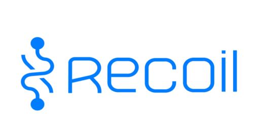
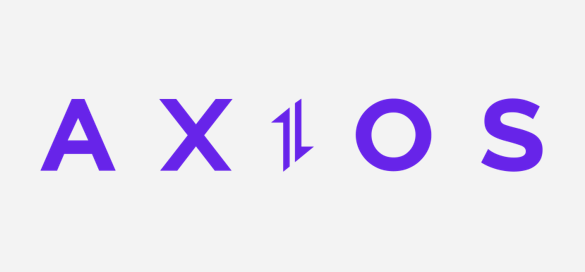
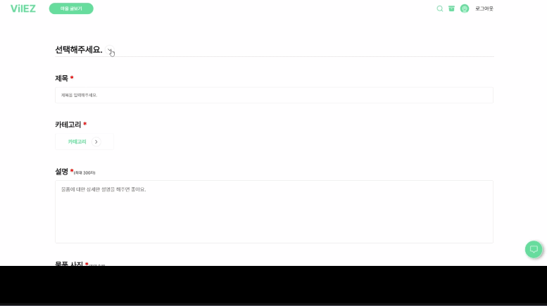

## VilEZ

```markdown
잠깐 필요한 물품이 없어 곤란했던 경험.
당장 쓰지 않는 물건을 빌려줘서
이웃이 기뻐하는 모습.

이 모습을 경험한다면 어떻게 될까요?
이웃끼리 따뜻함도 공유되지 않을까요?

빌리지의 이웃들과 함께
공유하기를 통해 물품을 빌려주고,
요청하기를 통해 물품을 빌려보세요.

VilEZ(빌리지)
```


## 프로젝트 소개

### 개요
- 삼성청년소프트웨어아카데미(SSAFY) 2학기 공통프로젝트(웹디자인)에서 만든 프로젝트
- 총 6명 ( 프론트엔드 3명, 백엔드 2명, 모바일 1명)
    
### 주제
- 이웃주민과 소통이 단절된 현대사회에서 서로 필요한 물품을 공유하고, 요청하는 플랫폼을 만들어 지역사회를 따뜻하게 만들려고 함


|JavaScript|React|recoil|emotion.js|axios|
|---|---|---|---|---|
||||||

### 메인 페이지
-   서비스 소개


### 로그인 / 회원가입

-   이메일 - 비밀번호를 사용한 회원가입과 OAuth 2.0을 활용한 소셜 로그인 


### 공유 물품 등록
-   multipart/form-data로 물품 이미지 업로드
-   Update 구성 과정에서 사용자가 입력했던 data를 그대로 받아와서 수정할 수 있게 구현함
 

### 공유 물품 목록 페이지
-   그리드 스타일로 리스트 구성
-   무한 스크롤을 활용한 사용자 친화적 구성


### 실시간 채팅 & 지도
-   Websocket과 STOMP를 활용
-   실시간으로 1:1 채팅과 kakao map 을 동시에 제어할 수 있음


### 공유 박스
-   현재 진행중 / 진행 예정인 공유 약속 표시


### 마이 페이지
-   사용자 프로필 / 적립 포인트 / 공유 약속
-   공유 캘린더 / 포인트 내역 / 나의 작성글

-   QR코드에 동네 인증 페이지 주소 연결, 모바일로 현재 위치 수집


## 배운 점 & 아쉬운 점

-   김종혁
	-   인내와 끈기, 모르는 부분이나 같이 이야기 해야할 부분에서 백엔드와 프론트간의 소통을 통해 소통능력 향상을 경험할 수 있었습니다.
	-   상태관리 라이브러리 중 recoil을 사용하여 react에서의 상태관리 방법에 대해서 경험할 수 있었습니다.
	-   컴포넌트간에 props를 내리는 방식, CRUD 중 U를 구성하는 것에 있어서 formData에 file형식으로 담겨가야 한다는 것을 빨리 알지 못해서 아쉬웠습니다.
-   김현영
	- 메인 페이지의 스크롤 애니메이션을 직접 구현하며 
	-  소셜 로그인을 구현하며 OAuth 2.0의 동작 과정을 이해할 수 있었습니다.
	- React의 lifecycle과 hook을 사용하며 CSR의 동작 과정을 이해할 수 있었습니다.
	- 프론트 구현 과정에서 필요한 API를 요청하며 백엔드와의 협업 방식을 경험하고 효율적인 의사소통 방식에 대해 고민할 수 있었습니다.
	- 성능 최적화, SEO 등 프로젝트 구현 초기에 짚고 넘어가야 할 사항에 대해 알 수 있었습니다.
-   사공지은
	-   API나 라이브러리의 공식 문서를 보는 데 능숙해지고, 이를 활용해 많은 궁금증과 오류를 해결할 수 있었습니다.
	-   recoil 사용법에 대해 공부하고, 이를 활용해 여러 컴포넌트에서 사용되는 데이터들의 관리를 효율적으로 하였습니다.
	-   axios interceptor에 대해 공부하고, 토큰을 관리하는 법을 터득하였습니다.
	-   테스트와 디버깅 과정에서 버그를 고치면서, 더 효율적인 컴포넌트 구조에 대해 고민해볼 수 있었습니다.
